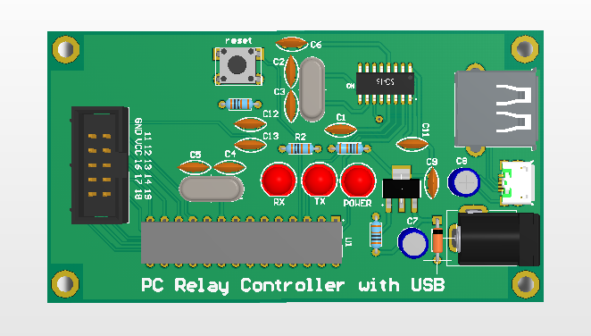

# relay-controller-with-usb-port
This project is for controlling I/O's (such relays) with usb port using USB to TTL

### PCB Project Folder
This folder contains PCB and schematic of project.

### codes
This folder contains the python and arduino based atmega328 codes to run and use. 
this project can control 10 pin of arduino. 
Code examples are simple and just for controlling one I/O (pin 13). in future I'll complete it to use all ports.

- instead of atmega328 we also can use atmega8a because the pins are exactly the same.

# TODO:
- [ ] write codes for all I/O's
- [ ] make python gui
- [ ] make schematics for using
